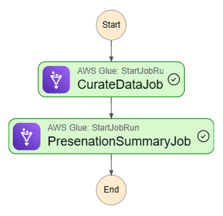

# Batch Data Processing Pipeline for Rental Marketplace Analytics

## Project Overview

This project implements a scalable **batch data processing pipeline** designed to support **analytics** and **business intelligence** for a **rental marketplace platform** (similar to Airbnb). The operational data originates from an **AWS Aurora MySQL database**, and the pipeline transforms and loads this data into **Amazon Redshift**, the central data warehouse, for downstream reporting and analysis.

> **Note:** This project is still **in progress**.

---

## Architecture

This solution follows the **Medallion Architecture (Bronze → Silver → Gold)** pattern using **Amazon S3 and Redshift** as the storage layer:

- `raw_data/` → Bronze: Raw ingested data  
- `curated layer in the Redshift` → Silver: Cleaned and transformed data  
- `presentation layer in the Redshift ` → Gold: Aggregated insights ready for analytics  

The pipeline processes data in batches, ensuring accuracy, traceability, and scalability for large datasets which is orchestrated using AWS Step Functions.

---

## Deployment Options

*NB: The Aws script to be uplload are int aws directory*

### Cloud Deployment (AWS)
In a full cloud setup:
- **Data Source:** AWS Aurora MySQL  
- **Processing:** AWS Glue & PySpark  
- **Storage:** Amazon S3 (Medallion zones)  
- **Data Warehouse:** Amazon Redshift  
- **Orchestration:** AWS Step Functions 

---

### Local Development Setup
For development and testing purposes, the pipeline can also run **locally** with the following substitutions:
- **PostgreSQL** is used instead of Redshift.
- Each Medallion stage (raw, curated, presentation) maps to a **different PostgreSQL schema**.

This setup provides fast iteration and validation before deploying to the cloud.

---

## Tech Stack

| Layer          | Technology        |
|----------------|-------------------|
| Ingestion      | AWS Glue / PySpark|
| Storage        | Amazon S3         |
| Transformation | PySpark           |
| Warehouse      | Amazon Redshift / PostgreSQL |
| Orchestration  | AWS Step Functions |

---

##  TODO 
- [ ] Add data validation and quality checks  

---

## 
# Setting on AWS 

## AWS Setup Instructions

### 1. S3 Bucket Structure
Create an S3 bucket for storing your data. Within this bucket:

### 2. Glue Catalog and Crawlers
- Create an **AWS Glue Crawler** to crawl the raw data folders.
- Choose **"Create a new database"** or use an existing one.
- Use an IAM role with `AmazonS3ReadOnlyAccess`, `AWSGlueServiceRole`, and other necessary permissions.
- Run the crawler to populate the Glue Data Catalog.

---

### 3. Glue Scripts
- Upload all your transformation scripts (from `aws/` folder) into AWS Glue Studio or directly as Glue Jobs.
- Assign the same IAM role used in the crawler.
- Set up job parameters (e.g., `--JOB_NAME`) and ensure S3 temp directories are defined for Redshift writes.
- Use **Glue DynamicFrame to JDBC** to push data into Redshift (via `write_dynamic_frame.from_jdbc_conf()`).

---

## Redshift Setup Instructions

### 1. Redshift Serverless (Recommended)
- Go to Amazon Redshift > **Serverless** and create a workgroup and namespace.
- Ensure it is in the same **VPC and subnet** as your Glue Jobs.

### 2. Redshift Connection in Glue
- Go to AWS Glue > **Connections**
- Create a new **JDBC Connection**
  - Type: Redshift
  - JDBC URL: from your Redshift cluster
  - Set credentials and test connection
- Attach this connection to your Glue job via `catalog_connection`
- Create vpc endpoints for the glue to access other services outside its network

### 3. Initialize Redshift Tables
- Run provided SQL scripts (in `sql/init_db.sql`) to initialize the schemas:
NB : with this architecture, the raw date in the s3 bucket, the curate and presentation schema table are in the redshift.

### 3. Creating Stae Machine (Step Function)
-Using Visual Assistance, drag and drop the glue job components and provide the neccessary parameter for the each state(ie the job name)
- Attache IAM role to the state machine to be able to access glue
---
## Ouput of the Pipeline After Executing the Step Functions

